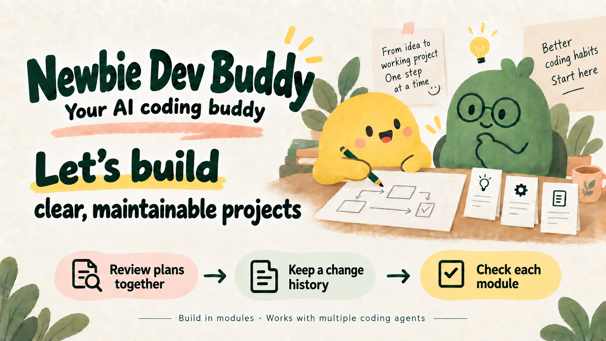
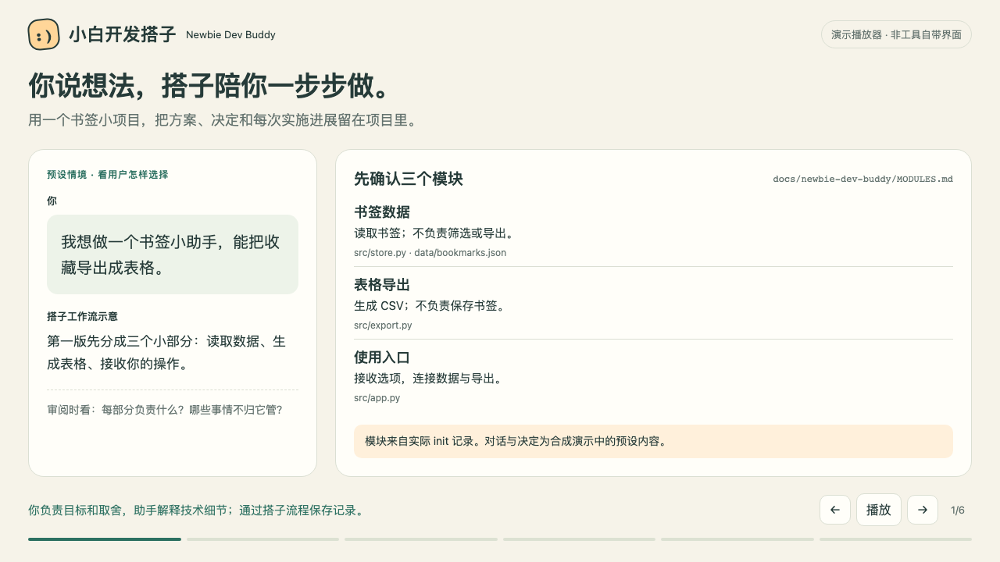

# Newbie Dev Buddy

[简体中文](README.zh-CN.md)

**Let’s build clear, maintainable projects.**

**Newbie Dev Buddy (小白开发搭子)** is an open-source AI development Skill for people without a professional programming background. It helps you work with your coding agent to give each part of a project a clear responsibility, review changes before implementation, and retain the decisions you will need when the project grows.

You describe what you want to build. Your agent explains the structure and prepares the technical details; you discuss the choices and decide which plan to accept. Buddy keeps module maps, plan revisions, decisions, and implementation records in local Markdown. Optional module and integration checks connect those plans to actual verification evidence.



Buddy works inside your existing coding agent. It is a local Skill with a Python CLI, installed and invoked as `newbie-dev-buddy`.

[FAQ](docs/faq.md) · [Three use cases](docs/use-cases.md) · [Beginner guide (Chinese)](references/beginner-guide.md)

## Build a project you can keep working on

A clear structure means knowing what each module does, what it leaves to other modules, and how they communicate. Continued maintenance means understanding the impact of a change and why earlier decisions were made. Buddy gives you and your agent a process for working through both.

| Stage | What you and the agent work through | What remains in the project |
|---|---|---|
| Map the modules | Responsibilities, boundaries, inputs, outputs, and dependencies | A reviewed module map, uncertainties, and earlier map revisions |
| Review a change | Affected modules, behavior to preserve, alternatives, and observable completion criteria | The exact plan revision and your decision to accept, reject, or revise it |
| Implement and retain the history | Start the accepted change, implement it, and record the outcome | Implementation events, previous plans, and the reasons for changing direction |
| Check the result, when configured | Run selected module checks and checks across module interfaces | Actual reports, coverage, failures, and evidence that needs rechecking |

You can ask: “What will this change affect? What should still work afterward? How will we check it?” The agent prepares commands and technical fields; you do not need to write JSON or know architecture terminology to discuss the plan. These questions keep each review focused on behavior you can observe.

An accepted plan, an implemented change, and a verified result are separate states. Change records cover work done through Buddy's workflow; they do not automatically track every manual edit. The module map guides development, but does not enforce boundaries in the code.

## Start where your project is

**Starting from an idea:** describe the problem and the smallest useful first version. The agent proposes modules and explains their relationships before saving the initial map with `init`. Planned code paths may not exist yet; a plan is kept separate from the implemented state.

> I want to build a tool that does…. Help me define the first version and explain its modules in plain language. Show me the proposed structure and uncertainties, and wait for my review before saving it or developing it.

**Working with existing code:** the agent inspects the current implementation, checks structural evidence, and proposes a reviewable map. Built-in `scan` records file inventories, fingerprints, and Python syntax observations; other languages primarily receive inventories. Optional CodeGraph provides additional multi-language structure clues. Neither scanner automatically determines business modules or refactors the project. Describing existing structure and proposing a redesign are separate tasks.

> Organize this project's modules and relationships. Separate source-confirmed findings from assumptions. Explain unassigned files and overlapping responsibilities, then show me a proposed map before saving it.

**Making a change or continuing in another conversation:** read the current map and relevant accepted plans first, check the latest source, then discuss a specific change. Previous revisions remain available when a new plan replaces them. A new agent can use these records without relying entirely on the previous conversation's compressed context.

> Read this project's status, module map, accepted plans, and implementation records. Check them against the current code. Tell me what is done, what remains unchecked, and which decision comes next before making changes.

See the [use cases and reproducible records](docs/use-cases.md) for examples. Records provide reference material; missing requirements and stale evidence still need discussion.

## See a complete example

[Watch / download the short demo](assets/demo.mp4) · [Reproduce the bookmark example](examples/bookmark-demo/README.md) · [Read the text walkthrough](docs/use-cases.md)

<details>
<summary>Preview the demo</summary>

[](assets/demo.mp4)

</details>

The Chinese-captioned video follows a fictional bookmark tool: save a three-module map, reject the first export plan, accept a revised plan, implement it, and read the records from a new process. CLI records and sample export checks are real; dialogue and decisions are scripted. No Kit runs in this example, so Kit verification remains `not_run`. The player is a presentation, not a built-in product UI or a live model-session recording.

## Requirements and installation

You need **Python 3.9+ on macOS or Linux**, and a coding agent that can discover local Skills and work with project files. On Windows, put the complete workflow—agent, Python, Buddy, optional CodeGraph, and project—inside the same WSL Linux environment. The PowerShell installation wrapper does not make the core project workflow Windows-native.

For a new Codex installation, download the source, preview the changes, then install:

```sh
git clone https://github.com/Lywooye/newbie-dev-buddy.git
cd newbie-dev-buddy
python3 scripts/install.py --agent codex --dry-run
python3 scripts/install.py --agent codex
```

**Basic installation is the default:** it installs Buddy together with its bundled Acceptance Kit runtime. Module planning, plan review, and records need only Python; **Node.js 22+ is required only for `run-checks` and `verify`**. Installation does not run checks, install Node or npm packages, or start a service. You do not need a separate Acceptance Kit Skill. CodeGraph and running verification are optional. If your existing installation belongs to a Skills manager, update it through that manager; the installer does not overwrite a different deployment.

Open the intended project in Codex, invoke `$newbie-dev-buddy`, and use one of the prompts above. Follow the installer's reported host steps and confirm the agent actually discovers the Skill before starting.

The installer has adapters for **Codex, Claude Code, Cursor, Windsurf/Cascade, Copilot CLI, WorkBuddy, CodeBuddy, OpenCode, pi, ZCode, DeepSeek Harness, and Trae**. Paths and configuration fixtures do not establish successful live model sessions in all 12 hosts. Use the [host-specific paths, invocation forms, and limits](references/agent-support.md); do not assume every agent has the same slash command.

Run the installer without arguments in an interactive terminal for its setup wizard, or use `--list-agents`. The `install.sh` and `install.ps1` wrappers forward the same Python options. See the advanced setup below for optional CodeGraph and project-only installation.

## What this version can establish

Buddy supports clearer structure and continued maintenance by making module boundaries, change impact, decisions, and verification scope explicit. The design and implementation still depend on your coding agent and your review. The CLI does not judge architecture quality, enforce code boundaries, authenticate human consent, or prevent direct edits outside the workflow.

**v0.6.0 is experimental.** Evidence comes from synthetic workflows and small Kit examples. Real beginners' long-term architecture and maintenance outcomes, production-project effectiveness, and comparative performance have not yet been evaluated. A saved map or passing check is not a guarantee of good architecture, complete coverage, or overall project quality.

Review here means reviewing plans and managing verification evidence. Buddy does not include a comprehensive code-review, vulnerability-scanning, or security-certification engine. Generated workflow prose is currently Chinese; supplied names, contracts, plans, and notes retain their language.

## Advanced setup and records

<details>
<summary>Optional CodeGraph and host configuration</summary>

CodeGraph is an external analyzer for symbols, calls, dependencies, and impact clues. The agent combines these with source and requirements; the accepted Markdown map remains the structure record. Buddy does not copy CodeGraph's engine or replace its graph.

Enhanced installation reuses a trusted compatible CodeGraph or downloads the pinned official **v1.6.2** release with SHA-256 verification, then prepares the selected host's MCP configuration. It does not upgrade an existing tool, index a project, change the system PATH, or configure unselected hosts. For a project-only OpenCode setup, replace the path and preview:

```sh
python3 scripts/install.py --agent opencode --mode enhanced \
  --scope project --project /path/to/project --dry-run
```

Remove `--dry-run` to install. Multiple `--agent` options select multiple hosts. Strict JSON MCP files can be merged while retaining unrelated settings; TOML, JSONC, DeepSeek overlays, and unconfirmed global paths receive separate candidates for manual application. An exit code of `2` may mean configuration still needs manual completion. Installing files, applying configuration, connecting MCP, and invoking tools through a model are separate results.

Before indexing, confirm the intended project, actual index root, and exclusions. Buddy's scan exclusions do not automatically configure CodeGraph. Recheck source when an index is stale. Discovery does not execute project scripts, install tools, redirect worktrees, or upload code. Cloud agents may send returned source snippets to their model service; local indexing is not network isolation or anonymization.

See [CodeGraph setup and boundaries](references/codegraph.md) and [host-specific configuration](references/agent-support.md).

</details>

<details>
<summary>Optional module and integration verification</summary>

Buddy includes a pinned Acceptance Kit runtime based on upstream **0.1.2**, with local security patches. `run-checks` and `verify` use it by default; both require **Node.js 22+**. You still need real project configurations and tests, and verification is optional. Basic planning and records need neither Node nor network access.

To use a trusted compatible external Kit, pass `--kit /path/to/acceptance-kit`; an invalid explicit path fails rather than falling back to the bundle. See the [configuration format](vendor/acceptance-kit/docs/configuration.md), [bundle source and patches](vendor/acceptance-kit/BUNDLE.json), and retained [MIT license](vendor/acceptance-kit/LICENSE). The bundled subset is part of Buddy, not a separate npm distribution; its Kit version remains `0.1.2`, while `BUNDLE.json` identifies the patched source.

Set a project default policy and module overrides: `manual` means checks are chosen for each change, `on-change` adds checks for affected modules to the change's check plan under an accepted policy, and `required` makes them delivery-evidence gates. Integration checks cover interfaces or flows across at least two modules; independent module reports cannot replace this evidence.

`propose` freezes the policy and check plan, configuration SHA and full JSON snapshot, required steps, and declared inputs. Configurations and configured source/test inputs must already exist and remain covered by the Kit; prepare new test files before proposing. Changing commands or configuration afterward requires a revised, accepted proposal. Add `.handoff/newbie-dev-buddy` to the Kit's `exclude` list without a trailing slash, so new records do not invalidate reports; do not exclude all relevant documentation.

`run-checks` validates the frozen configuration, executes every step in each selected configuration, rechecks the report, and records the result. It runs with the caller's permissions and **is not a sandbox**. Commands inherit the environment, and shared dependency directories or absolute paths can affect files outside the input copy. The plan's `steps` specify required evidence, not which commands execute. Inspect trusted commands before running them.

`verify` invokes the selected Kit's checker on an existing real report; it does not run project tests. Without a check ID, a validated overall report is historical evidence and does not mark every module as checked. At least one nonempty `tap` or `checks` behavior step must provide evidence; an exit-code-only step is insufficient for module verification. Checks still cannot prove test sufficiency or all business requirements.

The bundle rejects hardlinked source and evidence files and sends `SIGKILL` to the direct check process when it times out; it does not guarantee termination of every descendant. These patches change the Kit's `toolHash`. Recheck earlier external-Kit receipts using their original `--kit` directory, or rerun checks with the bundle; an old receipt is not automatically a pass for the new runtime.

Missing configuration, unrun, partial, passed, failed, and stale evidence remain distinct. `status` reads events and local fingerprints; it does not rerun checks. Recheck historical evidence with `verify` before relying on it. Map, input, or report changes can make earlier evidence stale.

`delivery_ready` requires every required check and relevant configured interface check for required modules to pass. Any executed failed or stale check blocks that gate. Without required rules it is `null`, not a whole-project quality claim. If checks cannot run, retain the reason and open verification items rather than inventing a passing report.

See [verification policies, coverage, and state rules](references/verification.md) and [CLI commands and input schemas](references/cli.md).

</details>

<details>
<summary>Direct CLI, records, and handoff</summary>

For new projects, `init` saves the reviewed initial map. For existing code, `scan` → `map-propose` → `map-decide` produces a reviewed map. Changes follow `propose` → `decide` → record `started` → implement → record `implemented`, followed by selected checks when configured. Decisions check the exact candidate Markdown digest, latest revision, and tracked baseline. A note records the decision; it does not itself create permission.

Keep transport JSON under the project's `.handoff/newbie-dev-buddy/inputs/` or in an external temporary directory so creating inputs does not invalidate scans. Earlier accepted maps and changes remain; renames and moves preserve module IDs, while splits, merges, and retirements require explicit lineage. Retired IDs cannot be recycled. Updating a map does not rewrite accepted changes or silently expand their tracked scope.

Current module data lives in `docs/newbie-dev-buddy/MODULES.json`, with a generated `MODULES.md` for people to review. Both files are saved together and previous versions are retained. User-facing proposals and results follow the [beginner communication guidance](references/plain-language.md): explain behavior, necessary terms and user choices, improve wording, then check meaning and uncertainty. No separate rewriting tool is required. Handwritten MD edits remain suggestions; a format migration or view rebuild does not accept them. Legacy MD-only projects remain readable; see [sync and recovery](references/workflow.md#模块文档同步与恢复). Accepted changes live in `docs/newbie-dev-buddy/changes/`. Scans, map history, candidates, decisions, and events live under `.handoff/newbie-dev-buddy/`. **Back up both directories.** The readable module view can be rebuilt from the selected JSON. Historical records cannot be recovered from indexes. The `CURRENT.md` and `HISTORY.md` navigation indexes can be regenerated; `refresh` rebuilds those indexes, not the module scan or missing history.

Records remain local by default. Relative links help portability, but paths, inputs, findings, and Kit output can contain private information. There is no automatic anonymization; inspect records before sharing them.

Parameter errors exit with code `1`; completed failed or stale verification exits with code `2`. Inspect JSON results and exit status. Full commands and schemas are in the [CLI reference](references/cli.md); see also [discovery](references/discovery.md), [workflow and recovery](references/workflow.md), and [security](SECURITY.md).

</details>

## Development

```sh
python3 -m unittest discover -s tests -v
```

Tests use temporary synthetic projects and simulated decisions, including installing Buddy into an isolated host directory, running its bundled Kit with real Node, and rechecking actual receipts, failures, and stale evidence. CI is configured for the Python suite on Linux with Python 3.9 and 3.12 plus Node.js 22; bundled-runtime behavior and security tests on Linux and macOS with Node.js 22 and 24; and installer fixtures and platform wrappers on macOS and Windows. These tests do not establish production readiness, real beginners' long-term outcomes, or comparative performance.

Licensed under [MIT](LICENSE). The bundled Acceptance Kit retains its own [MIT copyright and license notice](vendor/acceptance-kit/LICENSE).
