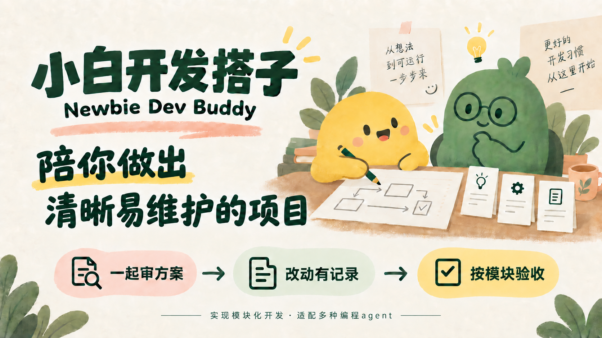

# 小白开发搭子 · Newbie Dev Buddy

[English](README.md)

**陪你做出 清晰易维护的项目**

小白开发搭子帮助**非专业开发者借助 AI，逐步做出架构清晰、便于维护的项目**。从第一版该做什么、各部分怎样分工，到下一次修改会影响哪里，搭子引导编程助手把这些事情说明白，并把讨论结果留在项目里，方便以后继续开发。

你负责说清需求、选择方案和确认结果；AI 准备技术方案、代码和命令。搭子是给你现有编程助手使用的开源 Skill，配套 Python CLI 保存模块、方案、决定、实施和可选验收记录。安装名和调用名为 `newbie-dev-buddy`。



[新手使用指引](references/beginner-guide.md) · [常见问题](docs/faq.zh-CN.md) · [使用场景与案例文字版](docs/use-cases.zh-CN.md)

## 适合谁

- 有想法，想用 AI 做工具、网站或小应用，希望有人一起理清开发步骤。
- 已经写了一部分代码，想知道项目各部分负责什么、应该改哪里。
- 项目需要反复修改，希望保留以前的决定，换一个对话也有材料可查。

你不需要手写模块配置、JSON 或校验值，助手会准备这些技术字段。需要你参与的，是确认需求、指出不合适的方案，以及检查做出来的行为是否符合预期。

## 怎样帮助项目结构清楚、便于维护

一个模块是一部分有明确职责的代码。例如书签工具可以分为“读取数据”“生成导出表格”“接收使用选项”。先说清每部分负责什么、怎样配合，后续修改时才有依据定位影响。

搭子把这件事贯穿开发过程：

| 开发步骤 | 搭子和编程助手一起做什么 | 对后续开发有什么帮助 |
|---|---|---|
| **先理清结构** | 收敛第一版范围，提出模块职责、接口和依赖；已有项目结合源码梳理现状，再由你确认地图 | 知道代码各部分负责什么，哪些关系还需要核实 |
| **一起审方案** | 修改前定位模块和旧约束，说明影响、可选方案及可观察的完成条件 | 有依据决定怎样改、哪些行为要保留 |
| **实施并留记录** | 接受具体版本后再实施，保存方案修订、决定理由和实施进展 | 后续能查到为什么这样做，新方案保留旧记录 |
| **按模块验收** | 选配可信的 Acceptance Kit，运行选中的模块和跨模块检查，复核报告及覆盖范围 | 区分已检查、未检查、失败和需重验的部分 |

结构也可以随着项目调整。模块改名或移动时保留 ID；拆分、合并和退休说明对应关系，旧地图继续保留。修改涉及已有方案时，标明替换关系，避免新决定与旧约束混在一起。

这些机制为清晰架构和持续维护提供帮助。实际模块边界是否合理、代码是否遵守划分，仍需编程助手结合源码与测试核对；搭子不自动评价架构质量或强制代码边界。

## 在你的项目里怎么用

新项目、已有项目和后续维护，都可以从一句日常需求开始。下面是给助手的提示词；各宿主的具体调用方式见[宿主支持](references/agent-support.md)。

**从一个想法开始：**

> 我想做一个工具，实现……。请使用 newbie-dev-buddy，先和我明确第一版要做什么，再提出模块职责与关系。用我能理解的语言说明，列出不确定的地方，等我确认后再保存结构。

**接手已有项目：**

> 请使用 newbie-dev-buddy 梳理这个项目。结合源码说明各模块负责什么、怎样联系，区分已核实、推断和待核实。先给我候选地图、现有检查和覆盖缺口，确认后再保存。

**修改或换对话继续：**

> 先读模块地图、已接受方案和实施记录，再核对当前源码。我要修改……。告诉我会影响哪里、哪些行为需要保留，以及怎样检查结果。先讨论方案，不要直接改代码。

后续开发沿用同一项目的记录。新会话有材料可查，仍需核对源码、过期证据和没有写入记录的需求；记录不会自动补齐所有上下文。

## 先看一个可复现的例子

书签小助手用三个模块演示：第一稿提出全量导出，审阅后改成按标签导出；第二稿被接受后实施，第一稿和修改理由仍然保留；新的 CLI 进程再读取当前状态。

[观看 / 下载短视频](assets/demo.mp4) · [自己复现并检查输出](examples/bookmark-demo/README.md) · [阅读三个场景的文字说明](docs/use-cases.zh-CN.md)

<details>
<summary>看看演示画面</summary>

[](assets/demo.mp4)

</details>

演示使用预设对话与决定，真实调用 CLI、修改合成程序并检查导出结果。播放器是展示材料，不是产品自带界面，也不是真实模型会话录屏。本例未运行 Kit，不证明真实新手的架构设计或跨模型交接效果。

## 要求与安装

基础版只安装搭子，先用它讨论模块与方案即可；CodeGraph 和 Acceptance Kit 按需要再选。

- **环境：**macOS/Linux 上的 Python 3.9+。Windows 的完整流程使用 WSL，助手、Python、搭子和可选 CodeGraph 都放在同一个 Linux 环境，避免混用程序和项目路径。
- **助手：**需要能发现本地 Skill、操作项目文件。安装器提供 Codex、Claude Code、Cursor、Windsurf/Cascade、Copilot CLI、WorkBuddy、CodeBuddy、OpenCode、pi、ZCode、DeepSeek Harness 和 Trae 的适配。
- **已有安装：**由 Skills 管理器管理的部署，通过原管理器更新；不同的已有部署不会被直接覆盖。

首次安装到 Codex：

```sh
git clone https://github.com/Lywooye/newbie-dev-buddy.git
cd newbie-dev-buddy
python3 scripts/install.py --agent codex --dry-run
python3 scripts/install.py --agent codex
```

安装后按输出完成宿主操作，确认助手确实发现了 Skill。在 Codex 中打开目标项目，再说：

```text
$newbie-dev-buddy
先帮我明确第一版需求，或说明已有项目各部分负责什么、怎样配合。
给我候选模块地图和待核实项，等我确认后再保存。
```

其他助手的目录和调用形式见[宿主支持](references/agent-support.md)。安装与配置夹具的验证不代表每个助手的真实模型会话均已通过；PowerShell 安装入口和 Windows 夹具也不代表核心流程已原生兼容 Windows。

## 你会留下哪些材料

| 位置 | 内容 |
|---|---|
| `docs/newbie-dev-buddy/MODULES.md` | 当前模块地图：职责、路径、依赖和接口约定 |
| `docs/newbie-dev-buddy/changes/` | 已接受的具体修改方案 |
| `.handoff/newbie-dev-buddy/` | 扫描、地图历史、候选、决定和实施事件，以及验收结果记录 |

两部分一起备份；只有 `CURRENT.md`、`HISTORY.md` 导航索引可以重建。记录覆盖通过搭子流程进行的修改，不自动捕获所有手工编辑，也不替代 Git。

材料默认留在本地。相对链接便于移动，但输入、源码线索和 Kit 输出可能包含私人信息；分享前检查，工具不自动匿名化。

## 当前能力与验证范围

**v0.4.0 仍是实验版本。** 已有证据来自合成项目和外部 Kit 小样例，尚未在真实新手的生产项目或长期维护中评估，也没有优于其他工具的比较证据。工作流正文目前主要为中文；你输入的名称、契约、方案和说明保留原语言。

搭子支持方案审阅和验收证据管理。确认方案、完成实施、验收通过是三个不同状态；没有配置或没有运行，不算通过。Kit 的实际检查能力取决于配置和测试，不能证明所有业务需求已覆盖，也不是全面代码审查或安全认证。

模块地图和记录不能认证人类同意、阻止绕过流程的直接编辑，或单独证明架构合理、影响分析完整。把这些边界说明白，才能判断当前项目还需要补什么检查。

## 进阶配置与技术参考

<details>
<summary>可选 CodeGraph 与增强安装</summary>

内置 `scan` 保存结构清单和指纹：Python 提取语法观察，其他语言主要列文件。可选外部 CodeGraph 为助手补充多语言符号、依赖和影响线索；业务模块仍需结合源码确认，扫描不自动重构、运行项目脚本、切换工作区或上传代码。

增强安装复用兼容 CodeGraph；缺失时下载固定的官方 v1.6.2 发布包并核对 SHA-256，再准备所选宿主 MCP 配置。不升级已有程序，不自动建索引，也不修改全局信任或权限设置。

例如安装到一个 OpenCode 项目，替换路径并先预览：

```sh
python3 scripts/install.py --agent opencode --mode enhanced --scope project --project /path/to/project --dry-run
python3 scripts/install.py --agent opencode --mode enhanced --scope project --project /path/to/project
```

交互终端中不带参数运行可进入向导；`--list-agents` 列出适配宿主，重复 `--agent` 可以明确选多个。`install.sh` 和 `install.ps1` 转发相同参数，不安装 Python 或助手，不修改未选宿主。

严格 JSON 的 MCP 文件可合并并保留其他设置；TOML、JSONC、DeepSeek overlay 或未确认路径生成候选供手动应用。文件就绪、配置应用、MCP 连接和模型实际调用分别核对；增强安装不是连接成功的证明。搭子使用外部 CodeGraph，不复制其引擎或替代图谱。

[CodeGraph 接入](references/codegraph.md) · [宿主路径及限制](references/agent-support.md) · [已有项目梳理](references/discovery.md)

</details>

<details>
<summary>可选模块验收：怎样选检查、怎样判断结果</summary>

Kit 是独立的可信外部工具，本项目不自动安装。独立 Acceptance Kit 0.1.2 要求 Node.js 22+。可设项目默认策略、模块覆盖策略，以及跨模块检查；选定检查或已接受策略授权运行后才执行。

`propose` 冻结配置 SHA、完整 JSON、步骤与声明输入。配置、声明源码及测试须先存在且未被排除；新测试先准备再提案。实施开始后更换检查命令或配置，须修订并确认。

`run-checks` 核对冻结配置，以调用者权限运行选中配置的全部步骤，不是操作系统沙箱。地图中的 `steps` 指定必须具备通过证据的步骤，不是命令筛选器。`verify` 调用所选 Kit 检查器复核真实报告，不重新运行项目测试。在 Kit 的 `exclude` 中添加 `.handoff/newbie-dev-buddy`（不带末尾斜线），或排除整个 `.handoff`；保留相关源码、测试和文档，不要排除全部 `docs/`。

结果区分未配置、未检查、部分检查、通过、失败和需重验。`status` 只读记录与指纹，不重跑 Kit；历史通过沿用前仍须复核。整项目通过或未指定检查的报告，不会自动把所有模块标为通过，也不能替代模块间接口检查。

`delivery_ready` 只表示本次已配置的证据门槛：必需检查和必需模块相关的已配置接口检查都须通过；任一已运行检查失败或过期，会阻止已有门槛满足。没有必需规则时为 `null`。没有 Kit 时保留观察和待验项，不制造通过报告。

[配置、覆盖与状态规则](references/verification.md) · [安全边界](SECURITY.md)

</details>

<details>
<summary>直接使用 CLI、方案版本与恢复</summary>

助手通常代你准备输入文件和命令。直接调用时，新项目用 `init` 保存已确认初始地图；已有项目按 `scan → map-propose → map-decide` 接受具体候选。接受前核对完整 Markdown SHA、最新修订与基线；源码或旧图变化时重新评估。说明文件只记录已发生的确认，本身不能产生授权。

每次修改按 `propose → decide → record started → 实施 → record implemented` 进行，再按选定方式检查和保存证据。地图更新保留历史，不改写已接受方案或扩大旧方案路径范围；同位置的新方案可用 `supersedes` 标明替换关系。

生成的 map/spec JSON 放在项目 `.handoff/newbie-dev-buddy/inputs/` 或项目外临时目录，避免写入受检源码使扫描过期。`refresh` 只重建导航索引，不重新分析代码。参数错误退出码为 1；已完成但失败或过期的验收退出码为 2，需同时检查 JSON 与退出码。

[CLI 字段、命令和合成示例](references/cli.md) · [修订与恢复流程](references/workflow.md)

</details>

## 开发验证

```sh
python3 -m unittest discover -s tests -v
```

测试使用临时合成项目和模拟决定。Linux CI 使用 Python 3.9 和 3.12；macOS/Windows CI 检查安装夹具和包装脚本。仓库夹具验证 Kit 协议，外部 Kit 小样例不包含在 CI，也不证明生产适用性或比较优势。

采用 [MIT 许可证](LICENSE)。
